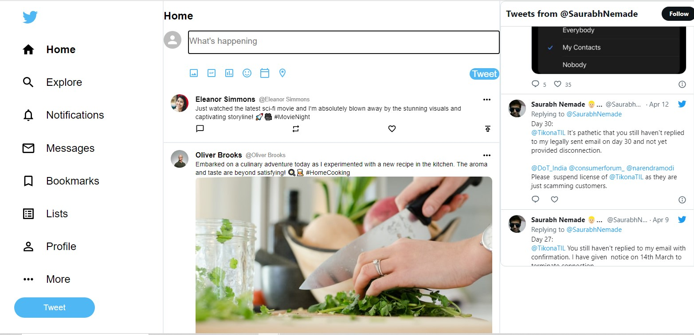

# Twitter Clone with Firebase Authentication



This is a Twitter clone built using React and Firebase Authentication. Users can sign up, log in, and log out to access a Twitter-like feed. The Twitter menu is not functional, but we use the `react-twitter-embed` widget to imitate the Twitter feed.

## Features

- User registration and authentication using email and password.
- Secure user sessions with Firebase Authentication.
- Ability to log in and log out.
- Twitter-like feed using the `react-twitter-embed` widget.

## Prerequisites

Before you begin, ensure you have met the following requirements:

- Node.js and npm installed on your development environment.
- Firebase project set up with your own Firebase project credentials. You will need to add these credentials to your `.env` file.
- The `react-twitter-embed` library is used to display Twitter-like feeds.

## Installation

1. Clone this repository:

   ```bash
   git clone https://github.com/GeorgiosDev/twitter
   ```

2. Navigate to the project directory:

   ```bash
   cd twitter-clone
   ```

3. Install the dependencies:

   ```bash
   npm install
   ```

4. Create a `.env` file in the project root and add your Firebase project configuration:

   ```env
   REACT_APP_API_KEY=your-api-key
   REACT_APP_AUTH_DOMAIN=your-auth-domain
   REACT_APP_PROJECT_ID=your-project-id
   REACT_APP_STORAGE_BUCKET=your-storage-bucket
   REACT_APP_MESSAGING_SENDER_ID=your-messaging-sender-id
   REACT_APP_APP_ID=your-app-id
   ```

5. Start the development server:

   ```bash
   npm start
   ```

6. Open your web browser and visit [http://localhost:3000](http://localhost:3000) to see the Twitter clone in action.

## Usage

- Click on "Sign Up" to create a new user account.
- Click on "Log In" to access your account.
- Click on "Log Out" to log out of your account.
- Explore the Twitter-like feed on the home page.

## Built With

- React - A JavaScript library for building user interfaces.
- Firebase Authentication - For user registration and authentication.
- `react-twitter-embed` - A widget for imitating a Twitter feed.


## License

This project is licensed under the MIT License - see the [LICENSE](LICENSE) file for details.


## Author


[ Deverakis Georgios]([https://github.com/your-username](https://github.com/GeorgiosDev))


